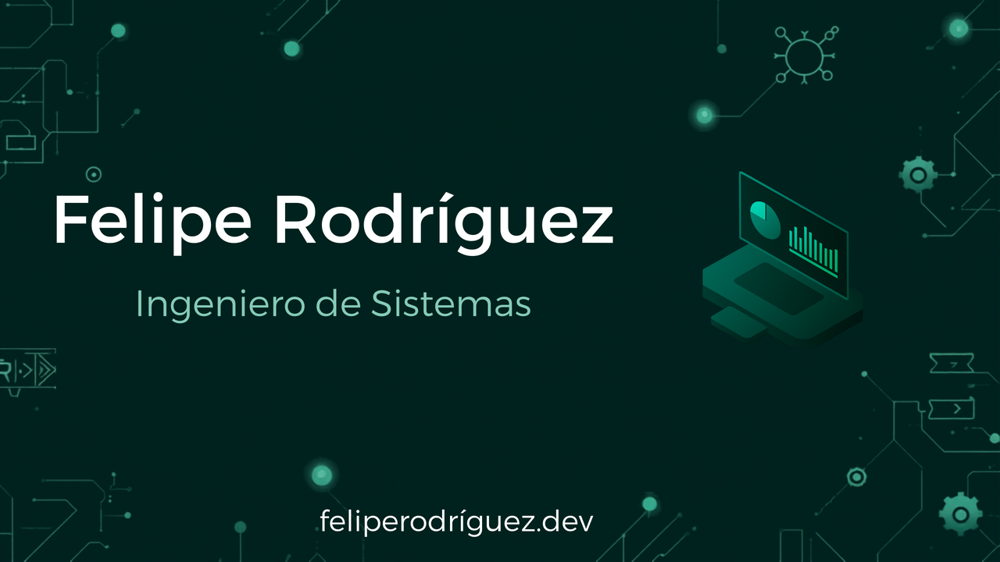

  

<h1 align="center">Hola 👋, soy Felipe Rodriguez</h1>

## 👨‍💻 Sobre mí

Soy estudiante de **Ingeniería de Sistemas** con interés en el desarrollo de software y la creación de soluciones tecnológicas.

Me caracterizo por ser una persona curiosa, responsable y con una fuerte disposición para aprender. Disfruto enfrentar nuevos desafíos, adquirir conocimientos en diferentes áreas de la tecnología y aplicar buenas prácticas en cada proyecto que desarrollo.

Mi objetivo es seguir creciendo como profesional, participando en proyectos que me permitan aportar valor y continuar ampliando mis habilidades técnicas.

---

# 🛠️ Tecnologías y Herramientas

Estas son algunas de las tecnologías y herramientas con las que he trabajado y continúo fortaleciendo mis conocimientos.

### 💻 Lenguajes de Programación

  

### ⚙️ Frameworks y librerías

  

### 🗄️ Bases de Datos

  

### 🧰 Herramientas

  

---

# 📊 Estadísticas de GitHub

  

  

---

# 📈 Actividad en GitHub

  

---

# 📌 Proyectos Destacados

 <table> <tr> <td width="50%">
🎮 Juego Picas y Fijas

Juego desarrollado en Java aplicando lógica de programación y manejo de estructuras de control.

 </td> <td width="50%">
⚽ Proyecto Fútbol

Aplicación web desarrollada utilizando HTML como parte del aprendizaje en desarrollo web.

 </td> </tr> </table> 

---

  
  

